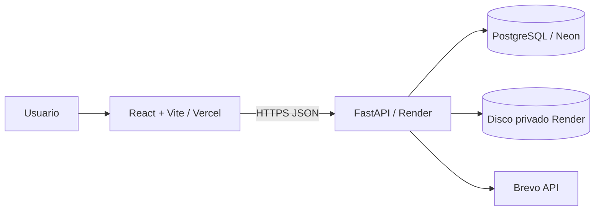

# Flujo de Control de Gastos

> Constitución vigente: **2.8.0**.

Aplicación web neutral respecto al tipo de organización para solicitar, evaluar, aprobar, ejecutar, dar seguimiento, corregir, cancelar, cerrar y documentar gastos con trazabilidad y evidencia verificable.

## Principios del producto

- FastAPI es la autoridad final de autorización y transiciones.
- La estructura organizacional es dato configurable, no código.
- `Usuario`, `Grupo`, `Rol`, `Permiso` y `Cargo/Posición` son conceptos separados.
- Grupo y Cargo pueden heredar Roles; **sus nombres nunca autorizan por sí mismos**.
- Todo usuario activo recibe el baseline `requests:read` y puede entrar a Inicio/Solicitudes para seguimiento.
- Ver una solicitud ajena no concede mutaciones.
- `config:manage` es administración técnica **system-only**; un usuario ordinario no puede obtenerla efectivamente por Rol/Grupo/Cargo/directo.
- `areas:manage` permite administrar Áreas/Categorías sin entregar Usuarios/Organigrama/Accesos.
- Los KPIs superiores del Dashboard son informativos; las filas de **Acciones pendientes** son las tareas interactivas.
- Solo solicitante original o Administrador del sistema pueden **Cancelar** una solicitud abierta.
- Solo solicitante original o Administrador del sistema pueden **Corregir / reenviar** una solicitud corregible.
- Un aprobador que detecta un problema usa **Enviar a revisión** con comentario; no edita la solicitud ajena.
- Una revisión válida interrumpe inmediatamente la ronda y entrega la corrección al solicitante.
- **Cierre/factura es por solicitud:** solicitante, Administrador del sistema o delegado activo del solicitante.
- `requests:close` queda como permiso legacy inactivo y no autoriza cierre/factura.
- `APPROVED` no equivale a `CLOSED`.
- Área y Categoría son dimensiones independientes.
- SIMPLE/MULTI_QUOTE no cambia silenciosamente durante corrección.
- Las invitaciones de usuario y los cambios reales de Cargo notifican Cargo(s) y permisos efectivos.
- Documentos e historial forman parte del expediente auditable.
- Alembic es el mecanismo canónico de migraciones.

## Terminología

- **Usuario**: cuenta del sistema.
- **Grupo**: conjunto configurable de usuarios que puede heredar Roles.
- **Rol**: conjunto reutilizable de Permisos.
- **Permiso**: capacidad atómica implementada por el producto.
- **Cargo / Posición**: estructura organizacional configurable que puede heredar Roles; su nombre no autoriza directamente.
- **Área**: unidad/departamento/función asociada al gasto.
- **Categoría**: naturaleza del bien/servicio.
- **Gestión de Áreas**: configuración organizacional protegida por `areas:manage`.
- **Administración técnica**: funciones reservadas a `system_accounts` mediante `config:manage` system-only.
- **Enviar a revisión**: decisión de un aprobador para devolver inmediatamente la solicitud al solicitante con comentarios.
- **Corregir / reenviar**: edición de una solicitud existente reservada al solicitante original o al Administrador del sistema.
- **Delegación de cierre/factura**: asignación por solicitud que el solicitante concede a un usuario activo y puede revocar/cambiar.

## IAM configurable

```text
Usuario
  ├─ Baseline: requests:read
  ├─ Grupos ───────────> Roles ──> Permisos
  ├─ Cargos/Posiciones -> Roles ──> Permisos
  ├─ Roles directos ─────────────> Permisos
  ├─ Permisos directos
  └─ Capacidades por recurso/delegación
```

Permisos vigentes:

| Código | Capacidad |
| --- | --- |
| `requests:read` | Consultar dashboard, solicitudes y evidencia autorizada; baseline para usuarios activos |
| `requests:create` | Crear nuevas solicitudes y cargar soportes asociados |
| `requests:approve` | Participar en aprobación/votación y enviar a revisión cuando corresponda |
| `areas:manage` | Administrar Áreas/Categorías; configurable por Rol/Grupo/Cargo/usuario |
| `config:manage` | Administración técnica reservada exclusivamente a `system_accounts` |

`requests:close` permanece solo como registro legacy inactivo. **No** autoriza cierre, factura ni delegación.

`requests:read` es una capacidad base no revocable mientras el usuario esté activo. Para capacidades mutables configurables, ausencia de ALLOW significa DENY.

Una asignación histórica de `config:manage` a un usuario ordinario no se convierte en permiso efectivo.

### Herencia por Grupo y Cargo

```text
Rol: Aprobador
  requests:approve

Cargo Presidente      → Aprobador
Cargo Vicepresidente  → Aprobador
Cargo Tesorero        → Aprobador

Grupo Junta Directiva → Aprobador
```

El backend nunca pregunta si un Cargo se llama `TESORERO`, `PRESIDENTE`, `CFO`, etc. Autoriza por relaciones persistidas.

Para Áreas, Alembic `0006` crea un Rol neutral:

```text
Gestor de áreas
  areas:manage
```

El Administrador del sistema puede asociarlo desde Accesos a cualquier Grupo/Cargo configurado por la organización. Por ejemplo, un cliente puede asociarlo a grupos llamados Administración o Junta Directiva, pero esos nombres **no existen en la lógica de autorización**.

### Capacidades por recurso

No son permisos globales:

```text
can_cancel
can_correct
can_close
can_delegate_close
```

- `can_cancel`: solicitante original o Administrador del sistema, si el estado es cancelable.
- `can_correct`: solicitante original o Administrador del sistema, si el estado es corregible.
- `can_close`: solicitante original, Administrador del sistema o delegado activo, si el estado es `APPROVED`/`CLOSED`.
- `can_delegate_close`: solo solicitante original para administrar la delegación de esa solicitud.

Los códigos `APPROVAL_DECISION`, `QUOTATION_VOTE`, `CORRECT_REQUEST`, `CLOSE_REQUEST` tampoco son permisos IAM; son tareas contextuales.

## Administrador del sistema por ambiente

La cuenta de bootstrap se registra como `TECHNICAL_ADMIN` en `system_accounts`; no se identifica por email, Cargo o `UserRole.ADMIN`.

`/api/auth/login` y `/api/auth/me` exponen `is_system_account` para que el frontend construya la UX sin adivinar por títulos legacy. El backend sigue siendo la autoridad.

### Producción

Con `ENVIRONMENT=production`, sus permisos IAM efectivos máximos son:

```text
config:manage
areas:manage
requests:read
```

No participa en aprobación/votación ni obtiene permisos empresariales financieros.

Como excepciones explícitas de administración del ciclo de vida, sí puede:

- cancelar una solicitud abierta;
- corregir / reenviar una solicitud corregible;
- registrar/corregir factura y cerrar una solicitud cuando el estado lo permita.

Estas excepciones se validan mediante `system_accounts` y no equivalen a conceder permisos IAM empresariales.

### No producción

Para `ENVIRONMENT != production`, la cuenta técnica recibe todos los permisos atómicos activos para pruebas E2E y puede participar en workflows salvo exclusiones intrínsecas, como autoaprobación.

`RENDER=true` puede endurecer secretos/CORS, pero no sustituye `ENVIRONMENT=production` para autorización funcional.

## Configuración técnica vs Gestión de Áreas

La navegación se divide así:

```text
Administrador del sistema
→ Usuarios
→ Organigrama
→ Accesos
→ Áreas
→ Reglas / Auditoría técnica

Usuario ordinario con areas:manage
→ Áreas solamente

Usuario ordinario sin areas:manage
→ sin menú Configuración
```

Backend:

- IAM/Usuarios/Reglas/Auditoría siguen detrás de `config:manage` system-only.
- mutaciones de `/api/areas` requieren `areas:manage`.
- `include_inactive=true` para Áreas/Categorías requiere `areas:manage`.

Frontend:

```text
isSystemAdmin = user.is_system_account
canManageAreas = isSystemAdmin OR permission_codes contiene areas:manage
```

`iam-admin.jsx` solo inyecta **Accesos** en un menú marcado como perteneciente al System Admin.

Ver [docs/CONFIGURATION_ACCESS.md](docs/CONFIGURATION_ACCESS.md).

## Notificaciones de acceso

### Creación de usuario

Cuando se crea un usuario activo, el correo que contiene la contraseña temporal también informa:

```text
Cargo(s) activos
Permisos efectivos actuales
```

Los permisos se calculan después de aplicar Grupo/Rol/Cargo/permisos directos y se muestran con nombre legible + código.

### Cambio de Cargo

Cuando cambia realmente el conjunto `position_ids` de un usuario activo, el sistema recalcula su acceso y envía **Actualización de cargo y permisos**. Guardar el mismo Cargo no genera correo duplicado.

Si falla el correo obligatorio de cambio de Cargo, la transacción se revierte y el endpoint devuelve 502. El correo de cambio de Cargo nunca incluye contraseña temporal.

Fuente de verdad:

```text
Cargo(s) → UserPosition / Position
Permisos → effective_permission_codes()
```

Nunca se usan `UserRole`, `title` ni `can_*` legacy para construir el contenido.

Ver [docs/EMAIL_CONFIGURATION.md](docs/EMAIL_CONFIGURATION.md) y Feature 010.

## Dashboard y seguimiento universal

Todo usuario activo puede:

- abrir **Inicio / Dashboard**;
- ver métricas generales;
- abrir **Solicitudes**;
- consultar solicitudes creadas por otros usuarios.

Los KPIs superiores:

```text
Acciones que requieren mi atención
Solicitudes en proceso
Cerradas en 24 horas
```

son informativos (`article`), sin `onClick`.

Interacción explícita:

```text
fila de Acciones pendientes → modal contextual
Ver todas                    → Solicitudes
```

### Tareas personales

`pending_action_service.py` combina permiso/asignación/estado:

```text
APPROVAL_DECISION
= requests:approve + Approval.PENDING asignado al usuario

QUOTATION_VOTE
= requests:approve + invitación vigente + sin voto

CORRECT_REQUEST
= solicitud propia NEEDS_REVISION

CLOSE_REQUEST
= solicitud APPROVED + (solicitante original OR delegado activo)
```

`CORRECT_REQUEST` y `CLOSE_REQUEST` se asignan por responsabilidad concreta, no por permisos globales de edición/cierre.

El Administrador del sistema conserva facultades administrativas desde Solicitudes, pero no recibe automáticamente todas las correcciones/cierres como tareas personales.

Al seleccionar una fila, el frontend consulta:

```text
GET /api/expenses/{request_id}/my-actions
```

El modal revalida la tarea y puede mostrar:

- Aprobar;
- Rechazar;
- **Enviar a revisión**;
- votar una cotización;
- subir factura/cerrar;
- abrir la solicitud propia para **Corregir / reenviar**.

La aprobación contextual usa:

```text
POST /api/expenses/{request_id}/approval-decision
```

sin exponer el token bearer de enlaces de correo.

Después de una mutación se recargan Dashboard + `my-actions`.

## Enviar a revisión vs Corregir / reenviar

### Enviar a revisión — aprobador

Un aprobador con una aprobación `PENDING` que detecta un problema selecciona **Enviar a revisión** y escribe un comentario de al menos 3 caracteres.

Una sola `REVISION_REQUESTED` válida:

```text
approval actual → REVISION_REQUESTED
solicitud        → NEEDS_REVISION
otras aprobaciones PENDING/WAITING → EXPIRED
solicitante      → CORRECT_REQUEST
```

No espera mayoría. El solicitante recibe correo con el comentario.

### Corregir / reenviar — solicitante/Admin

Solo pueden ejecutar la edición:

```text
solicitante original
OR
Administrador del sistema en system_accounts
```

Un tercero recibe 403 aunque tenga `requests:create`, `requests:approve` o `config:manage`.

## Cierre, factura y delegación

`APPROVED` no equivale a `CLOSED`.

### Quién puede cerrar o gestionar factura

```text
solicitante original
OR
Administrador del sistema
OR
delegado activo creado por el solicitante para esa solicitud
```

`requests:close` no participa en esta decisión.

### Delegación

Solo el solicitante original puede crear, cambiar o revocar la delegación.

Reglas:

- una sola delegación activa por solicitud;
- el delegado debe ser usuario activo;
- no puede ser el propio solicitante;
- no puede ser una cuenta `system_accounts`;
- cambiar delegado revoca primero el anterior y conserva historial;
- revocar elimina inmediatamente la autoridad del delegado;
- el solicitante conserva siempre su propia autoridad.

API:

```text
GET    /api/expenses/{request_id}/closure-delegation
PUT    /api/expenses/{request_id}/closure-delegation
DELETE /api/expenses/{request_id}/closure-delegation
```

UI:

```text
APPROVED + can_close
→ Registrar factura y cerrar

CLOSED + can_close + factura
→ Corregir factura

can_delegate_close
→ Delegar cierre/factura
```

Componente modular:

```text
frontend/src/closure-delegation.jsx
```

Persistencia/auditoría:

```text
expense_closure_delegations
```

con `delegated_by_*`, `created_at`, `revoked_at` y `revoked_by_*`.

Ver [docs/CLOSURE_DELEGATION.md](docs/CLOSURE_DELEGATION.md).

## Solicitudes SIMPLE y MULTI_QUOTE

### SIMPLE

Requiere proveedor, monto y soporte/URL. Crear una solicitud nueva requiere `requests:create`.

### MULTI_QUOTE

La población se obtiene mediante:

```text
users_with_permission('requests:approve')
```

Fuentes válidas:

```text
Permiso directo
Rol directo
Grupo → Rol
Cargo → Rol
```

El solicitante se excluye de su propia ronda. Producción excluye cuentas técnicas del flujo financiero.

Las invitaciones persistidas representan el snapshot vigente de participantes.

## Corrección de solicitudes

`Corregir / reenviar` preserva siempre el tipo canónico:

```text
SIMPLE      → SIMPLE
MULTI_QUOTE → MULTI_QUOTE
```

La pestaña seleccionada para crear una nueva solicitud nunca decide el editor de corrección.

El formulario canónico es:

```text
frontend/src/expense-form.jsx
```

Para compatibilidad histórica se considera MULTI_QUOTE si:

```text
request_type == MULTI_QUOTE
OR status == QUOTATION_VOTING
OR quotation_options >= 2
```

Alembic `0003` repara esos registros legacy.

Una corrección MULTI_QUOTE:

- restaura opciones y soportes existentes;
- conserva por ahora la cantidad de opciones;
- permite editar proveedor/monto/URL/notas;
- genera `flow_id` nuevo;
- reinicia votos e invitaciones vigentes;
- conserva historial;
- limpia ganador/proveedor/monto seleccionado;
- vuelve a `QUOTATION_VOTING`;
- excluye siempre al **solicitante original** de la nueva población, incluso si Admin del sistema ejecutó la corrección.

Estados corregibles por solicitante/Admin:

```text
QUOTATION_VOTING
SUBMITTED
PENDING_APPROVAL
NEEDS_REVISION
APPROVED
REJECTED
```

No corregibles:

```text
CLOSED
CANCELLED
```

## Cancelación

Puede cancelar una solicitud abierta únicamente:

```text
solicitante original
OR
Administrador del sistema
```

Estados cancelables:

```text
QUOTATION_VOTING
SUBMITTED
PENDING_APPROVAL
NEEDS_REVISION
APPROVED
```

No cancelables:

```text
CLOSED
CANCELLED
REJECTED
```

Cancelar exige motivo y conserva actor/timestamp/razón.

## Área + Categoría

Área y Categoría son catálogos independientes con relación configurable N:M.

```text
Administración ─┐
IT              ├── Equipos
Operaciones     ┘
```

No se duplica una Categoría por cada Área.

La lectura del catálogo activo está disponible para los usuarios autenticados que necesitan clasificar/consultar solicitudes. Administrar el catálogo requiere `areas:manage`.

## Consola de Accesos

**Configuración → Accesos** es la pantalla autoritativa del IAM y está reservada al System Admin para:

- Usuarios;
- Grupos;
- Roles;
- Permisos;
- Cargos/Posiciones;
- miembros y Roles de Grupos;
- Roles heredados por Cargos;
- Cargos de Usuarios;
- Roles/permisos directos;
- Permisos efectivos y sus fuentes.

Para conceder Gestión de Áreas a colectivos de la organización, el System Admin puede asociar el Rol **Gestor de áreas** a los Grupos/Cargos deseados. Los nombres concretos no son parte del código.

La delegación de cierre/factura se administra desde la solicitud, no desde IAM global.

La pantalla legacy `AccessProfile/can_*` no es autoridad runtime.

## Arquitectura



Backend:

```text
backend/app/
├── api/
├── core/
├── models/
├── schemas/
├── services/
├── application.py
└── main.py
```

Frontend relevante:

```text
frontend/src/
├── expense-form.jsx
├── home-dashboard.jsx
├── closure-delegation.jsx
├── home-dashboard.css
├── iam-admin.jsx
├── main.jsx               # shell legacy aún pendiente
└── domain-normalization.js
```

Rutas/servicios canónicos relevantes:

```text
tracking.py
my_actions.py
revision_actions.py
cancellation_actions.py
closure_delegation.py
quotation_actions.py
financial_actions.py
areas.py
position_access.py
iam_service.py
closure_service.py
pending_action_service.py
approval_engine.py
```

Mientras partes de `main.jsx` permanezcan legacy, Vite mantiene bridges temporales para capacidades por recurso, componentes modulares y separación del menú de configuración. El backend sigue siendo autoridad.

## Seguridad

- JWT con expiración absoluta e inactividad configurable.
- Revocación mediante `session_version`.
- Argon2 para hashes nuevos; upgrade de PBKDF2 legacy tras login.
- CORS explícito.
- Documentos privados y firma real de archivo.
- Rate limiting por tipo de operación.
- `config:manage` system-only.
- `areas:manage` configurable sin nombres organizacionales hardcodeados.
- Autorización por IAM/capacidades base/reglas de recurso/system_accounts/delegaciones; nunca por Cargo hardcodeado.
- Backend revalida acciones aunque el frontend o una sesión previa estén desactualizados.

## Base de datos y migraciones

Cadena Alembic actual:

```text
20260817_0000 application baseline
→ 20260817_0001 IAM foundation
→ 20260817_0002 system accounts
→ 20260817_0003 MULTI_QUOTE request_type repair
→ 20260818_0004 position role inheritance
→ 20260818_0005 closure delegation
→ 20260818_0006 area management permission
```

`0004` crea `position_roles` e importa una sola vez configuración legacy de Cargos/Perfiles hacia IAM canónico.

`0005`:

- crea `expense_closure_delegations`;
- garantiza una delegación activa por solicitud;
- conserva historial de revocación;
- marca `requests:close` como inactivo/legacy.

`0006`:

- crea/upserta `areas:manage`;
- crea el Rol neutral `area-manager / Gestor de áreas`;
- describe `config:manage` como administración técnica;
- no asigna acceso a grupos/cargos por nombre.

Feature 010 no requiere migración; reutiliza el IAM existente.

El contenedor inicia con:

```text
alembic upgrade head
python -m scripts.bootstrap_admin
uvicorn app.application:app
```

## Correo por ambiente

Producción:

```text
Frontend: Vercel
Backend: Render
EMAIL_MODE=brevo
```

Local/development:

```text
Frontend: localhost
Backend: FastAPI/Docker
EMAIL_MODE=smtp
smtp.gmail.com
465 + ssl recomendado
587 + starttls alternativo
```

Nunca colocar `BREVO_API_KEY` o `SMTP_PASSWORD` en Vercel/Vite/repositorio.

El correo de aprobación usa las acciones:

```text
Aprobar
Rechazar
Enviar a revisión
```

El solicitante recibe el comentario cuando una solicitud entra en `NEEDS_REVISION`.

Los correos IAM de invitación y cambio de Cargo incluyen Cargo(s) + permisos efectivos. El cambio de Cargo es obligatorio: fallo de entrega revierte la actualización.

Para probar transporte:

```bash
docker compose exec backend python -m scripts.test_email --to destino@example.com
```

## Desarrollo local

Docker Compose publica el frontend en:

```text
http://localhost:3000
```

Vite directo usa normalmente:

```text
http://localhost:5173
```

No usar `docker compose down -v` salvo que se acepte eliminar datos locales.

Backend:

```bash
cd backend
python -m unittest discover -s tests -v
```

Frontend:

```bash
cd frontend
npm ci
npm run build
```

Docker:

```bash
docker compose build --no-cache
docker compose up -d
docker compose ps
```

## Validaciones manuales clave

### Configuración técnica vs Áreas

```text
1. System Admin: Configuración muestra Usuarios, Organigrama, Accesos y Áreas;
2. usuario ordinario sin areas:manage: no muestra Configuración;
3. desde Accesos, asociar Gestor de áreas a un Grupo/Cargo configurado;
4. volver a iniciar sesión con ese usuario;
5. Configuración debe mostrar únicamente Áreas;
6. verificar que no pueda abrir /api/iam/* ni Usuarios/Organigrama aunque manipule el frontend.
```

### Notificaciones de Cargo y permisos

```text
1. crear usuario activo con Cargo Tesorero;
2. confirmar que la invitación muestra Tesorero y permisos efectivos;
3. cambiar su Cargo a otro Cargo con permisos diferentes;
4. confirmar correo Actualización de cargo y permisos;
5. comprobar que los permisos del correo coinciden con Permisos efectivos en Accesos;
6. guardar nuevamente el mismo Cargo y confirmar que no llega correo duplicado.
```

### Enviar a revisión / corrección

```text
1. iniciar sesión como aprobador de una solicitud ajena;
2. comprobar que NO aparece Corregir / reenviar;
3. abrir su aprobación y seleccionar Enviar a revisión;
4. comprobar que se exige comentario;
5. enviar comentario y verificar NEEDS_REVISION inmediato;
6. comprobar que otros aprobadores dejan de tener una acción vigente;
7. iniciar sesión como solicitante y verificar CORRECT_REQUEST + Corregir / reenviar;
8. comprobar que Admin del sistema también puede corregir desde Solicitudes.
```

### Cierre/factura/delegación

```text
1. abrir una solicitud APPROVED como solicitante;
2. verificar Registrar factura y cerrar + Delegar cierre/factura;
3. delegar a otro usuario;
4. verificar que el delegado obtiene CLOSE_REQUEST y puede cerrar;
5. verificar que un tercero no delegado no puede cerrar aunque tenga requests:close legacy;
6. revocar la delegación y verificar pérdida inmediata de autoridad;
7. verificar que Admin del sistema puede cerrar por excepción administrativa;
8. en CLOSED, verificar Corregir factura solo para solicitante/Admin/delegado activo.
```

### MULTI_QUOTE

```text
1. corregir una MULTI_QUOTE como solicitante/Admin;
2. verificar Tipo de solicitud: Múltiples cotizaciones;
3. verificar Opciones para votación y evidencia existente;
4. reenviar;
5. confirmar que el solicitante original NO aparece en su propia nueva ronda.
```

### Dashboard

```text
1. KPIs superiores no son clicables;
2. una fila de Acciones pendientes abre modal;
3. Ver todas navega a Solicitudes;
4. después de mutación el Dashboard se refresca.
```

## GitHub Actions

La cuenta agotó temporalmente la cuota durante PR #9. Un run bloqueado por cuota **no se considera CI verde**. Mientras tanto, suite backend + build frontend + builds Docker son gates locales obligatorios.

## Documentación

Orden de autoridad:

1. `.specify/memory/constitution.md`
2. `specs/**/spec.md`
3. checklists/criterios
4. `specs/**/plan.md`
5. código
6. README/prompt/docs derivados

Features vigentes relevantes:

- Feature 003 — invariants de corrección SIMPLE/MULTI_QUOTE;
- Feature 005 — seguimiento universal/dashboard;
- Feature 006 — Grupo/Cargo → Rol → Permiso;
- Feature 007 — **Enviar a revisión** + propiedad de **Corregir / reenviar**;
- Feature 008 — cierre/factura por solicitante/Admin/delegación;
- Feature 009 — separación de configuración técnica vs Gestión de Áreas;
- Feature 010 — notificaciones de Cargo y permisos efectivos.

## Deuda de transición conocida

- `UserRole`, `users.title`, `can_*`, `AccessProfile`, `BOARD_CODES` permanecen físicamente como compatibilidad; no son autoridad runtime.
- `requests:close` permanece como registro legacy inactivo hasta su retiro físico futuro.
- `/api/users` legacy sigue temporalmente.
- `main.jsx` permanece monolítico en partes y contiene bypasses visuales legacy que el backend no confía.
- Vite mantiene bridges transitorios para componentes/capacidades/menú hasta modularizar el shell/tabla.
- `domain-normalization.js` sigue como capa temporal.
- la consola IAM puede seguir mostrando referencias legacy a `config:manage`; runtime lo filtra para usuarios no-system hasta retirar esa deuda visual.
- la fórmula exacta constitucional de quorum/mayoría para APPROVED/REJECTED y empate de cotizaciones sigue siendo deuda separada; **REVISION_REQUESTED sí está definida ya como interrupción inmediata**.
- outbox/retry persistente de correo aún no está implementado.
