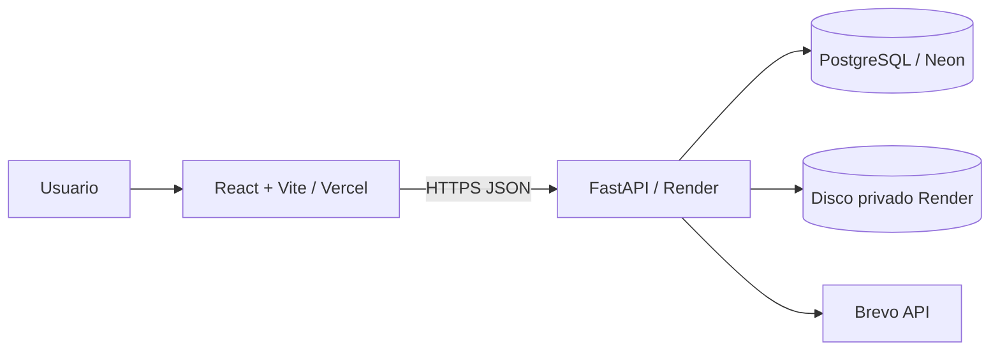

# Flujo de Control de Gastos

Aplicación web para solicitar, evaluar, aprobar, ejecutar y documentar gastos con trazabilidad y evidencia verificable.

El producto es **neutral respecto al tipo de organización**. Un PH, empresa, comité o área de negocio puede configurar su estructura sin modificar el código.

## Principios del producto

- Backend FastAPI es la autoridad final.
- La estructura organizacional es **dato configurable**, no código.
- `Usuario`, `Grupo`, `Rol`, `Permiso` y `Cargo` son conceptos separados.
- Un cargo no concede permisos.
- No existe un superusuario financiero implícito.
- Área y Categoría son dimensiones independientes.
- Documentos e historial forman parte del expediente auditable.
- Migraciones son versionadas con Alembic y no se ejecutan dentro del lifespan de FastAPI.

## Terminología

- **Usuario**: cuenta que interactúa con el sistema.
- **Grupo**: conjunto configurable de usuarios.
- **Rol**: conjunto configurable de permisos.
- **Permiso**: capacidad atómica del producto.
- **Cargo / Posición**: metadato organizacional descriptivo; no autoriza.
- **Área**: unidad/departamento/función asociada al gasto.
- **Categoría**: naturaleza del bien o servicio.

Ejemplo de clasificación:

```text
Área: IT
Categoría: Equipos
```

## IAM configurable

La autorización se calcula desde PostgreSQL:

```text
Usuario
  ├─ Grupos ──> Roles ──> Permisos
  ├─ Roles directos ──> Permisos
  └─ Permisos directos
```

Los permisos efectivos son la unión de esas fuentes. Si una capacidad no está permitida explícitamente, el resultado es DENY.

### Permisos atómicos iniciales

| Código | Capacidad |
| --- | --- |
| `requests:read` | Consultar solicitudes/documentos autorizados |
| `requests:create` | Crear/corregir solicitudes y cargar soportes |
| `requests:approve` | Participar en votaciones y decisiones |
| `requests:close` | Subir/reemplazar factura y cerrar |
| `config:manage` | Administrar configuración e IAM |

Los clientes pueden crear grupos, roles, cargos y asignaciones desde la interfaz; no pueden inventar permisos que el backend no implemente.

### Cuenta técnica

La cuenta creada por `ADMIN_*` es una cuenta de sistema protegida. Sus permisos efectivos máximos son:

```text
config:manage
requests:read
```

No puede crear, aprobar ni cerrar solicitudes, incluso si una asignación posterior intenta concederle esos permisos.

## Consola gráfica de Accesos

En **Configuración → Accesos** se administran:

- usuarios;
- grupos;
- roles;
- permisos;
- cargos;
- miembros de grupos;
- roles de grupos;
- roles directos;
- permisos directos;
- cargos de cada usuario;
- permisos efectivos.

Ejemplo PH, configurado como datos:

```text
Grupo: Administración PH
  Rol: Gestión de solicitudes
    requests:create
    requests:close
    requests:read

Grupo: Junta Directiva
  Rol: Aprobador
    requests:approve
    requests:read
```

Una empresa puede reemplazar estos grupos por Procurement, Finance, IT, Executive Committee o cualquier estructura propia sin cambiar el código.

## Arquitectura



Backend:

```text
backend/app/
├── api/          # HTTP / APIRouter
├── core/         # Settings, DB, security, rate limit
├── models/       # SQLAlchemy
├── schemas/      # Pydantic
├── services/     # lógica reutilizable
├── application.py
└── main.py       # alias de compatibilidad
```

### FastAPI

- `APIRouter` separa dominios/capacidades.
- `get_db()` entrega una sesión SQLAlchemy por request y la cierra siempre.
- configuración centralizada con `pydantic-settings`.
- `lifespan` no ejecuta DDL/backfills/seeds de negocio.
- rutas nuevas con SQLAlchemy/filesystem síncrono se implementan con `def` para usar el threadpool de FastAPI.
- contratos sensibles usan response models explícitos.
- tests HTTP usan `FastAPI TestClient`.

## Seguridad

- JWT firmado con expiración absoluta.
- inactividad de sesión configurable.
- revocación mediante `session_version`.
- Argon2 para hashes nuevos mediante `pwdlib`.
- hashes PBKDF2 legacy se migran automáticamente a Argon2 tras login exitoso.
- rate limiting separado para read/write/upload/sensitive.
- CORS explícito en producción.
- documentos privados y validación de firma real de archivo.
- autorización por permisos persistidos; no por emails/nombres de cargos/IDs mágicos.
- cuenta técnica segregada del flujo financiero.

## Base de datos y migraciones

Alembic es la herramienta canónica. La cadena actual es lineal y se valida automáticamente en tests:

```text
backend/alembic/versions/
├── 20260817_0000_application_baseline.py
├── 20260817_0001_iam_foundation.py
└── 20260817_0002_system_accounts.py
```

- `0000` define un baseline determinista y libre de dominio inmobiliario para una base PostgreSQL limpia; cuando encuentra tablas productivas existentes, las conserva.
- `0001` crea/migra el IAM configurable.
- `0002` identifica y protege las cuentas técnicas.

El contenedor ejecuta antes de FastAPI:

```text
alembic upgrade head
python scripts/bootstrap_admin.py
uvicorn app.application:app
```

Esto evita DDL dentro del lifespan y no depende de una función `preDeployCommand` de pago en Render.

> Para despliegues futuros con múltiples réplicas, las migraciones deben moverse a una etapa única de release/pre-deploy para evitar carreras.

Antes de una migración productiva, crear snapshot/branch de respaldo en Neon. La topología Alembic se prueba en CI, pero una migración real contra Neon/PostgreSQL de preview sigue siendo un smoke test de despliegue separado.

## Desarrollo local

### Requisitos

- Python 3.12+
- Node.js 20+
- PostgreSQL/Neon

### Backend

```bash
cd backend
python -m venv .venv
# activar .venv
pip install -r requirements.txt
alembic upgrade head
python scripts/bootstrap_admin.py
uvicorn app.application:app --reload
```

`uvicorn app.main:app --reload` continúa funcionando como alias de compatibilidad.

### Frontend

```bash
cd frontend
npm ci
npm run dev
```

### Docker Compose local

El entorno local completo se inicia con:

```bash
docker compose up --build
```

El frontend depende del `healthcheck` de `/api/health`, por lo que Nginx no debe arrancar hasta que FastAPI esté disponible.

Los scripts `.sh` que se ejecutan dentro de contenedores Linux deben conservar finales de línea LF. El repositorio fuerza `*.sh text eol=lf` mediante `.gitattributes` y el `backend/Dockerfile` vuelve a normalizarlos durante el build para proteger también checkouts de Windows con CRLF.

Si Docker muestra:

```text
exec /app/scripts/start.sh: no such file or directory
```

pero el Dockerfile sí copió el script, reconstruir primero con el código actualizado:

```bash
git pull
docker compose down
docker compose build --no-cache backend
docker compose up
```

Para diagnosticar únicamente el backend:

```bash
docker compose ps -a
docker compose logs backend --tail=200
docker compose up db backend --build
```

No usar `docker compose down -v` salvo que se acepte eliminar los datos PostgreSQL locales.

## Variables principales

Backend:

```env
ENVIRONMENT=production
DATABASE_URL=<NEON_URL>
SECRET_KEY=<32+ RANDOM CHARS>
ANALYTICS_HASH_KEY=<DIFFERENT 32+ RANDOM CHARS>
PUBLIC_URL=<VERCEL_URL>
CORS_ALLOWED_ORIGINS=<VERCEL_URL>
TOKEN_EXPIRE_MINUTES=480
SESSION_IDLE_MINUTES=30
APP_TIME_ZONE=America/Panama

EMAIL_MODE=brevo
BREVO_API_KEY=<SECRET>
BREVO_SENDER_NAME=Gestión de Solicitudes
EMAIL_FROM=<VERIFIED_EMAIL>

ADMIN_NAME=Administrador del sistema
ADMIN_EMAIL=<TECHNICAL_ADMIN_EMAIL>
ADMIN_PASSWORD=<12+ SECURE CHARS>

UPLOAD_DIR=/app/uploads
MAX_UPLOAD_STORAGE_MB=450
```

Frontend:

```env
VITE_API_URL=<RENDER_BACKEND_URL>
VITE_TIME_ZONE=America/Panama
```

Las variables `VITE_*` son públicas porque quedan empaquetadas en el navegador.

## Clasificación Área + Categoría

Área y Categoría son catálogos independientes con relación configurable N:M.

```text
Administración ─┐
IT              ├── Equipos
Operaciones     ┘
```

No se duplica la categoría `Equipos` por cada Área.

Por compatibilidad histórica todavía existen nombres físicos legacy (`expense_type`, `expense_subcategory`, etc.). El contrato funcional nuevo es siempre Área + Categoría.

## Flujo de solicitudes

### Simple

Una solicitud simple contiene proveedor, monto y soporte/cotización. La creación requiere `requests:create`.

### Múltiples cotizaciones

La población de votación se obtiene desde usuarios con `requests:approve`, excluyendo al solicitante y cuentas técnicas. Las invitaciones guardadas representan el snapshot de participantes de esa ronda.

> La regla exacta futura de quorum/empate de cotizaciones es una decisión funcional separada. El refactor IAM no declara resuelta esa semántica.

### Aprobación

La población canónica de aprobadores se obtiene desde `requests:approve`, no desde cargos como Presidente/Tesorero ni flags `can_approve`.

> La fórmula de mayoría legacy todavía requiere una feature separada para ajustarse completamente a la Constitución 2.2.1.

### Cierre

Cerrar o reemplazar factura requiere `requests:close`. `APPROVED` no equivale a `CLOSED`.

## Testing

```bash
cd backend
python -m unittest discover -s tests -v
```

Incluye pruebas HTTP IAM con `FastAPI TestClient`, topología Alembic y regresión de portabilidad Windows→Linux para `.gitattributes`, entrypoint shell y healthchecks de Docker Compose.

```bash
cd frontend
npm run build
```

CI ejecuta:

- Python compile;
- backend tests;
- frontend production build;
- backend Docker build;
- smoke test del entrypoint backend dentro de la imagen Linux;
- frontend Docker build.

## Documentación

Orden de autoridad:

1. `.specify/memory/constitution.md`
2. `specs/*/spec.md`
3. criterios de aceptación
4. `specs/*/plan.md`
5. código
6. README/prompts/docs derivados

Documentos principales:

- `docs/DOCUMENTATION_POLICY.md`
- `docs/TERMINOLOGY.md`
- `docs/CLASSIFICATION_MODEL.md`
- `docs/IAM_MODEL.md`
- `docs/FASTAPI_ARCHITECTURE.md`
- `docs/HISTORY.md`
- `CHANGELOG.md`
- `PROMPT_RECONSTRUCCION.md`

Un cambio de comportamiento sin su documentación correspondiente se considera incompleto.

## Deuda de transición conocida

- `UserRole`, `title` y `can_*` permanecen temporalmente para compatibilidad con el frontend/router legacy; no autorizan.
- `/api/users` legacy se mantiene detrás de `config:manage` mientras migra la UI operacional.
- `frontend/src/main.jsx` sigue siendo monolítico.
- `domain-normalization.js` sigue como capa temporal.
- partes no extraídas de `api/expenses.py` todavía contienen lógica legacy, pero las rutas canónicas críticas se registran antes y usan IAM.
- quorum/mayoría de aprobación y reglas de empate de cotizaciones requieren specs funcionales separadas.
