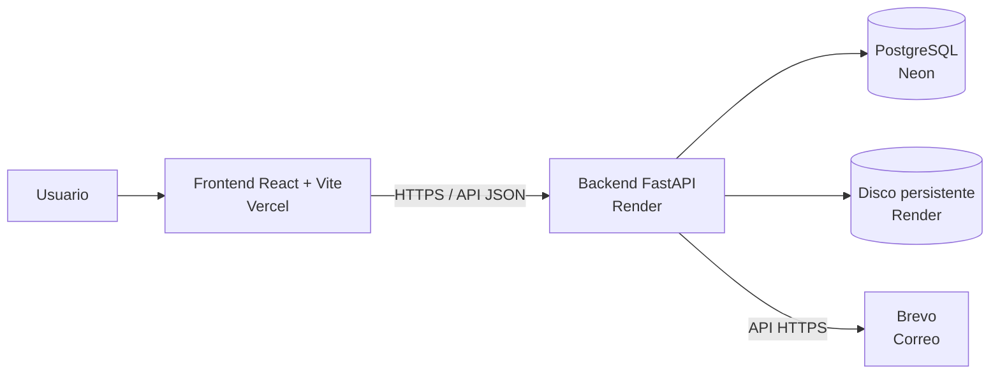

# Flujo de Control de Gastos

Aplicación web para solicitar, evaluar, aprobar y documentar gastos con evidencia verificable de cada decisión.

## Contexto y propósito

El control de gastos es un punto sensible tanto en organizaciones empresariales —por ejemplo, operaciones logísticas 3PL— como en la administración de una propiedad horizontal. Cuando las solicitudes, evaluaciones y aprobaciones dependen de conversaciones informales o documentos físicos, resulta difícil demostrar quién tomó una decisión, cuándo la tomó y qué alternativas tenía disponibles.

Este proyecto busca convertir el proceso completo en un expediente digital, trazable y auditable. Cada gasto debe conservar la solicitud original, las opciones de productos y proveedores, las cotizaciones evaluadas, las decisiones de la junta directiva y la documentación final.

La aplicación permite reducir problemas como:

- dificultad para confirmar quién aprobó o rechazó una solicitud;
- falta de fecha, hora, comentarios o justificación de las decisiones;
- poca visibilidad sobre los proveedores y productos evaluados;
- riesgo de conflictos de interés o análisis insuficiente;
- documentación dispersa entre correos, mensajes y archivos físicos;
- demoras para localizar facturas, cotizaciones o actas de años anteriores;
- controversias que no pueden resolverse objetivamente por falta de evidencia.

El propósito no es únicamente agilizar aprobaciones. El sistema debe funcionar como una fuente confiable de evidencia que permita reconstruir qué ocurrió, quién participó, qué información estaba disponible y cómo se llegó al resultado final.

## Objetivos

- Registrar la fecha, hora y responsable de cada solicitud y decisión.
- Evidenciar aprobaciones, rechazos y solicitudes de corrección.
- Documentar la evaluación de múltiples opciones cuando corresponda.
- Centralizar cotizaciones, facturas, actas y documentos relacionados.
- Facilitar auditorías y consultas históricas sin depender de archivos físicos.
- Mantener un historial íntegro que no pueda modificarse silenciosamente.
- Aplicar permisos y políticas de aprobación de manera consistente.

## Arquitectura actual



| Componente | Implementación actual | Responsabilidad |
| --- | --- | --- |
| Frontend | React con Vite en Vercel | Interfaz, navegación, formularios y comunicación con la API. |
| Backend | FastAPI con SQLAlchemy en un contenedor Docker de Render | Reglas de negocio, autenticación, autorización, auditoría y acceso a datos. |
| Base de datos | PostgreSQL en Neon | Usuarios, solicitudes, decisiones, políticas y eventos históricos. |
| Documentos | Disco persistente privado de Render | Cotizaciones, facturas y demás archivos adjuntos. |
| Correo | API HTTPS de Brevo | Invitaciones, solicitudes de aprobación, votaciones y notificaciones. |
| Autenticación | JWT firmado por el backend | Sesiones con vencimiento absoluto, inactividad y revocación por usuario. |

Vercel entrega únicamente el frontend. El navegador llama directamente a la URL pública del backend indicada por `VITE_API_URL`. Render procesa la solicitud, valida la sesión y los permisos, consulta Neon y accede al disco privado cuando se requiere un documento. Los archivos no se publican como contenido estático: el backend autoriza cada descarga.

## Tipos de usuario

- **Administrador del sistema:** cuenta técnica inicial creada con las variables `ADMIN_*`. Administra el sistema, pero no representa al administrador operativo de la propiedad horizontal.
- **Administrador de la PH:** usuario operativo creado desde el portal y asignado al perfil correspondiente.
- **Miembros de junta directiva:** presidente, vicepresidente, tesorero, vocal u otros perfiles configurados.
- **Solicitantes y demás usuarios:** sus permisos dependen de los perfiles asignados desde el portal.

La presidencia y tesorería no se configuran con correos fijos en variables de entorno. Los miembros, cargos y políticas de aprobación se administran desde el portal web. El flujo no requiere construir apartamentos, asignar unidades ni clasificar usuarios como propietarios.

## Reglas principales

- La cédula se normaliza y debe ser única entre los usuarios.
- Las personas se pueden buscar por cédula, nombre, apellido o correo electrónico.
- Las aprobaciones se asignan por perfiles y políticas configurables, no por direcciones de correo codificadas.
- Los eventos de aprobación son de solo anexado para preservar la auditoría.
- Las aprobaciones pendientes no expiran por tiempo; permanecen vigentes hasta recibir respuesta o hasta que el flujo sea invalidado.

## Seguridad

- JWT con vencimiento absoluto configurable mediante `TOKEN_EXPIRE_MINUTES`.
- Cierre de sesión tras `SESSION_IDLE_MINUTES` minutos sin actividad humana. El frontend informa actividad mediante `POST /api/auth/activity`; el polling no mantiene viva la sesión.
- Revocación de sesiones mediante una versión de sesión almacenada por usuario.
- Bloqueo temporal por intentos fallidos de inicio de sesión.
- Límites separados para lecturas, escrituras, cargas y acciones sensibles.
- Validación del contenido real de archivos PDF, JPEG, PNG y WEBP.
- CORS restringido, CSP y encabezados de seguridad en producción.
- Secretos y contraseñas fuera del repositorio.

Valores iniciales recomendados:

```env
TOKEN_EXPIRE_MINUTES=480
SESSION_IDLE_MINUTES=30
USER_READ_RATE_LIMIT=120
USER_WRITE_RATE_LIMIT=30
USER_UPLOAD_RATE_LIMIT=6
USER_SENSITIVE_RATE_LIMIT=10
```

Los límites se expresan por usuario y por minuto. Deben ajustarse usando métricas reales antes de aumentarlos.

## Correo con Brevo

En producción se usa la API HTTPS de Brevo, por lo que no es necesario configurar un puerto SMTP en Render.

```env
EMAIL_MODE=brevo
BREVO_API_KEY=< CLAVE API DE BREVO >
BREVO_SENDER_NAME=< NOMBRE VISIBLE DEL REMITENTE >
EMAIL_FROM=< CORREO VERIFICADO EN BREVO >
```

El correo de `EMAIL_FROM` debe estar verificado en Brevo. SMTP puede conservarse como opción local; Brevo ofrece `smtp-relay.brevo.com` y el puerto `587`, pero no es la opción recomendada cuando Render bloquea conexiones SMTP salientes.

## Desarrollo local

### Requisitos

- Python 3.12 o compatible.
- Node.js 20 o compatible.
- PostgreSQL o una cadena de conexión de Neon.

### Backend

```powershell
cd backend
python -m venv .venv
.venv\Scripts\Activate.ps1
pip install -r requirements.txt
uvicorn app.main:app --reload
```

### Frontend

```bash
cd frontend
npm install
npm run dev
```

Copia los archivos `.env.example` correspondientes y reemplaza únicamente los marcadores `< LO QUE SE SUPONE QUE DEBERIA IR >`. Nunca uses claves reales en archivos versionados.

## Variables de Render

Estas variables pertenecen al backend. Las credenciales deben configurarse únicamente en Render y nunca copiarse al frontend ni guardarse en el repositorio.

```env
ENVIRONMENT=production
DATABASE_URL=< URL DE CONEXION DE NEON >
PUBLIC_URL=< URL PUBLICA DEL FRONTEND EN VERCEL >
CORS_ALLOWED_ORIGINS=< URL PUBLICA DEL FRONTEND EN VERCEL >

SECRET_KEY=< SECRETO ALEATORIO LARGO >
ANALYTICS_HASH_KEY=< OTRA CLAVE ALEATORIA LARGA >
TOKEN_EXPIRE_MINUTES=480
SESSION_IDLE_MINUTES=30
# Variable heredada observada en Render; el backend actual no la consume.
APPROVAL_LINK_HOURS=< NO APLICA EN EL FLUJO ACTUAL >

USER_READ_RATE_LIMIT=120
USER_WRITE_RATE_LIMIT=30
USER_UPLOAD_RATE_LIMIT=6
USER_SENSITIVE_RATE_LIMIT=10
APP_TIME_ZONE=America/Panama

EMAIL_MODE=brevo
BREVO_API_KEY=< CLAVE API DE BREVO >
BREVO_SENDER_NAME=< NOMBRE VISIBLE DEL REMITENTE >
EMAIL_FROM=< CORREO VERIFICADO EN BREVO >

ADMIN_NAME=Administrador del sistema
ADMIN_EMAIL=< CORREO DEL ADMINISTRADOR DEL SISTEMA >
ADMIN_PASSWORD=< CONTRASENA SEGURA DE AL MENOS 12 CARACTERES >

UPLOAD_DIR=/app/uploads
MAX_UPLOAD_STORAGE_MB=450
```

| Variable | Propósito | ¿Es secreta? |
| --- | --- | --- |
| `ENVIRONMENT` | Activa las validaciones y medidas correspondientes a producción. | No |
| `DATABASE_URL` | Cadena privada de conexión de SQLAlchemy a PostgreSQL en Neon. | Sí |
| `PUBLIC_URL` | URL pública del frontend usada para construir enlaces enviados por correo. | No |
| `CORS_ALLOWED_ORIGINS` | Lista de orígenes web autorizados para llamar a la API; en producción debe contener la URL HTTPS de Vercel. | No |
| `SECRET_KEY` | Firma y valida los JWT. Debe ser larga, aleatoria y diferente en cada entorno. | Sí |
| `ANALYTICS_HASH_KEY` | Genera identificadores seudónimos sin exponer directamente la identidad de los usuarios. Debe ser distinta de `SECRET_KEY`. | Sí |
| `TOKEN_EXPIRE_MINUTES` | Duración absoluta máxima del JWT. El valor actual recomendado es 480 minutos. | No |
| `SESSION_IDLE_MINUTES` | Tiempo máximo sin actividad humana antes de cerrar la sesión. El valor actual es 30 minutos. | No |
| `APPROVAL_LINK_HOURS` | Variable heredada visible en Render, pero no es consumida por el backend actual. Las aprobaciones pendientes no vencen por horas; se invalidan al decidirse o cuando el flujo deja de ser vigente. Puede eliminarse de Render. | No |
| `USER_READ_RATE_LIMIT` | Máximo de lecturas por usuario y minuto. | No |
| `USER_WRITE_RATE_LIMIT` | Máximo de escrituras por usuario y minuto. | No |
| `USER_UPLOAD_RATE_LIMIT` | Máximo de cargas de archivos por usuario y minuto. | No |
| `USER_SENSITIVE_RATE_LIMIT` | Máximo de acciones sensibles por usuario y minuto. | No |
| `APP_TIME_ZONE` | Zona horaria utilizada por el backend para presentar información temporal. | No |
| `EMAIL_MODE` | Selecciona el adaptador de correo: `brevo` en producción, `console` en desarrollo o `smtp` como alternativa. | No |
| `BREVO_API_KEY` | Credencial para consumir la API de Brevo. | Sí |
| `BREVO_SENDER_NAME` | Nombre visible del remitente. | No |
| `EMAIL_FROM` | Dirección remitente verificada en Brevo. | Normalmente no, aunque debe controlarse su modificación |
| `ADMIN_NAME` | Nombre de la cuenta técnica inicial. | No |
| `ADMIN_EMAIL` | Correo de inicio de sesión del administrador técnico. | Dato sensible |
| `ADMIN_PASSWORD` | Contraseña inicial del administrador técnico. | Sí |
| `UPLOAD_DIR` | Ruta privada del disco persistente donde se almacenan documentos. | No |
| `MAX_UPLOAD_STORAGE_MB` | Cuota total que la aplicación puede ocupar dentro de `UPLOAD_DIR`; no es el límite individual de cada archivo. | No |

No configures `TREASURER_EMAIL`, `PRESIDENT_EMAIL` ni variables SMTP si `EMAIL_MODE=brevo`.

La lista observada en Render coincide con las variables anteriores, con dos consideraciones:

- `APPROVAL_LINK_HOURS` está configurada, pero actualmente no tiene efecto y puede eliminarse.
- `ENVIRONMENT` no aparece en la captura. En Render, el backend también reconoce la variable de plataforma `RENDER=true` para aplicar las validaciones de producción; por eso `ENVIRONMENT=production` es recomendable para expresar la intención, pero no es imprescindible en ese proveedor.

## Variables de Vercel

Según la configuración actual mostrada en Vercel, ambas variables aplican a los entornos **Production** y **Preview**:

```env
VITE_API_URL=< URL PUBLICA DEL BACKEND EN RENDER >
VITE_TIME_ZONE=America/Panama
```

| Variable | Valor esperado | Explicación |
| --- | --- | --- |
| `VITE_API_URL` | La URL HTTPS pública de Render, sin una ruta privada ni credenciales. | Indica al navegador dónde está la API. Aunque Vercel la muestre como `Sensitive`, Vite incorpora las variables `VITE_*` al paquete del frontend y su valor puede ser inspeccionado por cualquier usuario. No es un secreto. |
| `VITE_TIME_ZONE` | `America/Panama` | Controla la zona horaria utilizada para mostrar fechas y horas en la interfaz. |

Las variables de Vite se leen durante la compilación. Después de modificar cualquiera de estas variables en Vercel es necesario volver a desplegar el frontend. Cambiar una variable de Render también requiere reiniciar o desplegar nuevamente el servicio para que el backend lea el valor nuevo.

## Orden recomendado de despliegue

1. Publica primero el backend actualizado en Render.
2. Confirma que abre el puerto asignado por Render y que el endpoint de salud responde.
3. Ejecuta o deja completar las migraciones.
4. Publica el frontend en Vercel con la URL correcta del backend.
5. Comprueba el inicio de sesión, `POST /api/auth/activity`, la búsqueda de personas y un envío real de correo.

Si Render queda en `Waiting for application startup` o muestra `No open ports detected`, revisa el error anterior en el log. Normalmente la aplicación no abrió el puerto porque falló una migración o una conexión con PostgreSQL. No termines sesiones de Neon sin identificar primero el proceso y su consulta.

## Reiniciar Neon desde cero

El reinicio elimina datos y debe hacerse solamente de forma explícita:

1. Crea una rama de respaldo en Neon.
2. Detén temporalmente el backend o evita nuevos accesos.
3. Confirma que Render ya contiene la versión nueva del código.
4. Vacía el esquema de la rama de producción y ejecuta las migraciones o la inicialización.
5. Verifica que se creó solamente el administrador técnico definido por `ADMIN_*`.
6. Crea desde el portal el administrador de la PH, los perfiles y los miembros de junta.
7. Comprueba la cédula única, los permisos y las políticas de aprobación.

Vaciar Neon no elimina los archivos del disco persistente de Render. Para reiniciar completamente el entorno también debe vaciarse por separado el contenido de `/app/uploads`, conservando el directorio montado.

## Endpoints destacados

- `POST /api/auth/login`: inicio de sesión.
- `POST /api/auth/activity`: registra actividad humana y renueva la sesión activa.
- `GET /api/users`: listado y búsqueda por cédula, nombre o correo.
- Rutas de organigrama: perfiles, cargos y miembros de junta.
- Rutas de solicitudes: creación, consulta, adjuntos y seguimiento.
- Rutas de aprobación: decisiones mediante sesión o enlace seguro.

La documentación interactiva está disponible en `/api/docs` cuando la configuración del entorno la habilita.

## Verificación

```bash
cd backend
pytest
```

```bash
cd frontend
npm run build
```

Antes de producción prueba también:

- expiración por 30 minutos de inactividad;
- renovación con actividad humana;
- límites de solicitudes;
- rechazo de una cédula duplicada;
- creación de miembros de junta sin apartamentos ni roles de propiedad;
- envío mediante Brevo;
- carga y descarga autorizada de adjuntos.
