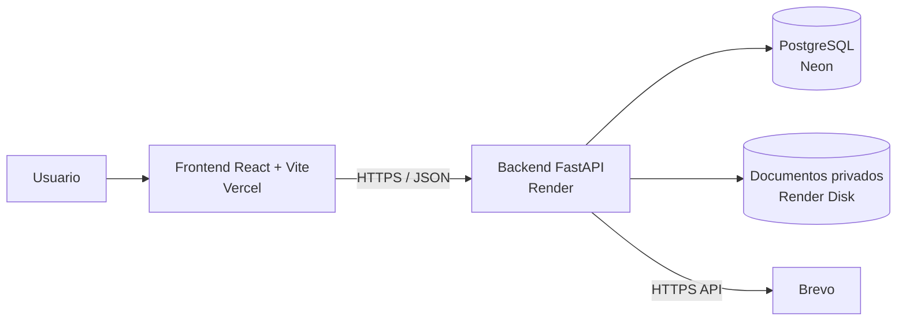

# Flujo de Control de Gastos

Aplicación web para solicitar, evaluar, aprobar, ejecutar y documentar gastos con evidencia verificable de cada decisión.

El producto está diseñado para ser neutral respecto al tipo de organización: puede utilizarse en empresas, PH u otras organizaciones sin que el núcleo dependa de conceptos inmobiliarios.

## Propósito

Cada solicitud debe convertirse en un expediente digital trazable que permita reconstruir:

- quién creó la solicitud y cuándo;
- qué Área y Categoría se asociaron al gasto;
- qué proveedores, opciones y cotizaciones fueron evaluados;
- quién votó, aprobó, rechazó o solicitó corrección;
- qué documentos estaban disponibles en cada etapa;
- cuál fue la opción seleccionada;
- qué factura corresponde al gasto ejecutado;
- cómo evolucionó el flujo sin alterar silenciosamente su historia.

## Terminología canónica

La aplicación utiliza los siguientes términos funcionales:

- **Usuario**: cuenta que interactúa con el sistema. La UI usa Usuario/Usuarios, no Persona/Personas como nombre del dominio de cuentas.
- **Área**: unidad, departamento o función organizacional asociada al gasto.
- **Categoría**: naturaleza del bien o servicio adquirido.

Ejemplo:

```text
Área: IT
Categoría: Equipos
```

Área y Categoría son catálogos independientes. Una misma Categoría puede habilitarse para varias Áreas.

Documentación detallada:

- `docs/TERMINOLOGY.md`
- `docs/CLASSIFICATION_MODEL.md`

## Dominio excluido

El modelo canónico no debe depender de:

- apartamentos;
- propietarios/copropietarios;
- residentes/arrendatarios;
- `PersonType`;
- `OwnershipRole`;
- relaciones usuario-apartamento.

La limpieza física de datos legacy es una migración separada y requiere respaldo previo.

## Arquitectura



| Componente | Implementación | Responsabilidad |
| --- | --- | --- |
| Frontend | React + Vite / Vercel | UX, formularios, navegación y consumo de API. |
| Backend | FastAPI + SQLAlchemy / Docker / Render | Negocio, autorización, auditoría y acceso a datos. |
| Base de datos | PostgreSQL / Neon | Usuarios, solicitudes, catálogos, políticas y eventos. |
| Documentos | Render persistent disk | Cotizaciones, facturas y evidencia privada. |
| Correo | Brevo HTTPS API | Invitaciones, votaciones, aprobaciones y notificaciones. |
| Autenticación | JWT | Expiración absoluta, inactividad y revocación. |

El frontend nunca accede directamente a PostgreSQL o al almacenamiento privado. El backend es la autoridad final.

## Clasificación Área + Categoría

### Área

Ejemplos:

- Administración
- Operaciones
- IT
- Mantenimiento
- Marketing
- Recursos Humanos

### Categoría

Ejemplos:

- Equipos
- Servicios / Consultoría
- Insumos
- Software / Licencias
- Mobiliario
- Capacitación

### Relación

Una Categoría puede habilitarse para múltiples Áreas mediante una relación configurable Área ↔ Categoría.

API canónica:

```text
GET    /api/areas
POST   /api/areas
PATCH  /api/areas/{area_id}
GET    /api/areas/categories
POST   /api/areas/categories
PATCH  /api/areas/categories/{category_id}
POST   /api/areas/{area_id}/categories
POST   /api/areas/{area_id}/categories/{category_id}
DELETE /api/areas/{area_id}/categories/{category_id}
```

## Compatibilidad legacy de clasificación

Durante la migración se mantienen temporalmente nombres físicos anteriores para no romper expedientes históricos:

```text
expenses.expense_type        -> Área
expenses.expense_subcategory -> Categoría
expense_categories           -> almacenamiento legacy de Áreas
expense_subcategories        -> puente temporal Área-Categoría
```

Las estructuras canónicas nuevas incluyen:

```text
expense_category_catalog
expense_area_categories
```

La compatibilidad física no cambia el lenguaje funcional: el producto usa **Área + Categoría**.

## Usuarios, perfiles y permisos

El backend utiliza la entidad `User` y rutas `/api/users`.

Los usuarios pueden incluir identidad, nombres, apellidos, correo, teléfono, cargo/perfil y estado. Las capacidades deben evolucionar hacia autorización completamente persistida en PostgreSQL; no deben depender de correos, IDs mágicos o conceptos inmobiliarios.

El administrador técnico inicial se crea mediante `ADMIN_*`, pero no debe utilizarse su nombre o correo como regla de autorización.

## Solicitudes

Tipos principales:

- `SIMPLE`: una opción/cotización.
- `MULTI_QUOTE`: múltiples opciones y una ronda de selección antes de aprobación.

Estados vigentes incluyen:

```text
QUOTATION_VOTING
SUBMITTED
PENDING_APPROVAL
APPROVED
REJECTED
CANCELLED
CLOSED
NEEDS_REVISION
```

Aprobar no equivale a cerrar. Una solicitud aprobada permanece en proceso hasta completar los requisitos de ejecución/cierre.

## Documentos y auditoría

Los documentos son privados y deben validarse por contenido real. Las sustituciones deben preservar versiones anteriores.

Las acciones relevantes deben ser trazables con actor, fecha/hora, entidad, cambio de estado y motivo/comentario cuando aplique. Los eventos históricos críticos son append-only.

## Seguridad

Configuración base:

```env
TOKEN_EXPIRE_MINUTES=480
SESSION_IDLE_MINUTES=30
USER_READ_RATE_LIMIT=120
USER_WRITE_RATE_LIMIT=30
USER_UPLOAD_RATE_LIMIT=6
USER_SENSITIVE_RATE_LIMIT=10
DEFAULT_PAGE_SIZE=25
MAX_PAGE_SIZE=100
QUERY_TIMEOUT_MS=5000
APP_TIME_ZONE=America/Panama
```

Principios:

- JWT con expiración absoluta;
- timeout por inactividad humana;
- revocación por versión de sesión;
- rate limiting diferenciado;
- CORS restrictivo;
- secretos fuera de Vite y logs;
- ORM/consultas parametrizadas;
- autorización siempre validada en backend;
- archivos privados con validación MIME + firma real.

## Desarrollo local

### Backend

```powershell
cd backend
python -m venv .venv
.venv\Scripts\Activate.ps1
pip install -r requirements.txt
uvicorn app.main:app --reload
```

### Frontend

```powershell
cd frontend
npm install
npm run dev
```

## Variables de entorno

### Backend / Render

```env
ENVIRONMENT=production
DATABASE_URL=<URL PRIVADA DE NEON>
PUBLIC_URL=<URL HTTPS DEL FRONTEND>
CORS_ALLOWED_ORIGINS=<ORIGENES HTTPS AUTORIZADOS>
SECRET_KEY=<SECRETO ALEATORIO>
ANALYTICS_HASH_KEY=<SECRETO ALEATORIO DIFERENTE>
TOKEN_EXPIRE_MINUTES=480
SESSION_IDLE_MINUTES=30
APP_TIME_ZONE=America/Panama
EMAIL_MODE=brevo
BREVO_API_KEY=<CLAVE BREVO>
BREVO_SENDER_NAME=<NOMBRE VISIBLE>
EMAIL_FROM=<CORREO VERIFICADO>
ADMIN_NAME=Administrador del sistema
ADMIN_EMAIL=<CORREO ADMIN TECNICO>
ADMIN_PASSWORD=<CONTRASENA SEGURA>
UPLOAD_DIR=/app/uploads
MAX_UPLOAD_STORAGE_MB=450
```

### Frontend / Vercel

```env
VITE_API_URL=<URL HTTPS DEL BACKEND>
VITE_TIME_ZONE=America/Panama
```

Las variables `VITE_*` son visibles en el navegador y no pueden contener secretos.

## Pruebas y CI

Backend:

```powershell
cd backend
python -m compileall -q app
python -m unittest discover -s tests -v
```

Frontend:

```powershell
cd frontend
npm ci
npm run build
```

CI también construye las imágenes Docker de backend y frontend.

## Documentación y Spec-Driven Development

La documentación forma parte obligatoria del Definition of Done.

Fuentes principales:

- `.specify/memory/constitution.md` — reglas transversales del proyecto.
- `specs/001-domain-normalization/spec.md` — requisitos e historias de la normalización actual.
- `specs/001-domain-normalization/plan.md` — diseño técnico y compatibilidad.
- `specs/001-domain-normalization/checklists/acceptance.md` — criterios verificables.
- `PROMPT_RECONSTRUCCION.md` — comportamiento canónico para reconstrucción.
- `docs/DOCUMENTATION_POLICY.md` — qué documentos revisar en cada cambio.
- `docs/TERMINOLOGY.md` — lenguaje funcional canónico.
- `docs/HISTORY.md` — decisiones funcionales y técnicas.
- `CHANGELOG.md` — cambios entregables.

**Regla:** un cambio no está completo si el código y la documentación afectada discrepan sin que la diferencia esté explícitamente documentada como transición/deuda.

## Migraciones destructivas

Antes de eliminar tablas, columnas o datos productivos:

1. crear backup/snapshot;
2. inventariar datos y dependencias;
3. aplicar migración versionada en staging/test;
4. validar integridad y aplicación;
5. documentar recuperación real;
6. aplicar en producción solo después de validación.

Un downgrade que recrea estructura no recupera datos borrados.

## Documentación adicional

Consulta `docs/README.md` para el índice completo del proyecto.
