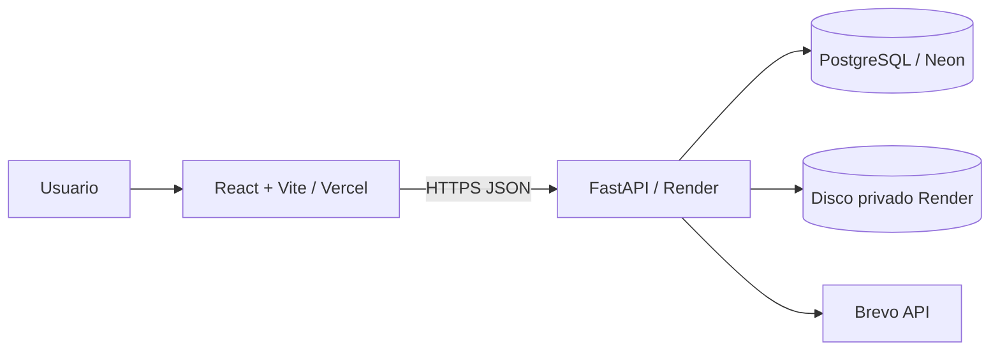

# Flujo de Control de Gastos

> Constitución vigente: **2.3.3**.

Aplicación web para solicitar, evaluar, aprobar, ejecutar y documentar gastos con trazabilidad y evidencia verificable.

El producto es **neutral respecto al tipo de organización**. Un PH, empresa, comité o área de negocio puede configurar su estructura sin modificar el código.

## Principios del producto

- Backend FastAPI es la autoridad final.
- La estructura organizacional es **dato configurable**, no código.
- `Usuario`, `Grupo`, `Rol`, `Permiso` y `Cargo` son conceptos separados.
- Un cargo no concede permisos.
- La cuenta técnica tiene política explícita por ambiente.
- Área y Categoría son dimensiones independientes.
- Una corrección nunca cambia silenciosamente el tipo de solicitud.
- La pestaña seleccionada antes de corregir nunca determina el tipo del editor.
- Documentos e historial forman parte del expediente auditable.
- Migraciones son versionadas con Alembic y no se ejecutan dentro del lifespan de FastAPI.

## Terminología

- **Usuario**: cuenta que interactúa con el sistema.
- **Grupo**: conjunto configurable de usuarios.
- **Rol**: conjunto configurable de permisos.
- **Permiso**: capacidad atómica del producto.
- **Cargo / Posición**: metadato organizacional descriptivo; no autoriza.
- **Área**: unidad/departamento/función asociada al gasto.
- **Categoría**: naturaleza del bien o servicio.

## IAM configurable

Para usuarios operativos:

```text
Usuario
  ├─ Grupos ──> Roles ──> Permisos
  ├─ Roles directos ──> Permisos
  └─ Permisos directos
```

Si una capacidad no está permitida explícitamente, el resultado es DENY.

### Permisos atómicos iniciales

| Código | Capacidad |
| --- | --- |
| `requests:read` | Consultar solicitudes/documentos autorizados |
| `requests:create` | Crear/corregir solicitudes y cargar soportes |
| `requests:approve` | Participar en votaciones y decisiones |
| `requests:close` | Subir/reemplazar factura y cerrar |
| `config:manage` | Administrar configuración e IAM |

Los clientes pueden crear grupos, roles, cargos y asignaciones desde la interfaz; no pueden inventar permisos que el backend no implemente.

## Administrador del sistema por ambiente

La cuenta creada por `ADMIN_*` se registra como `TECHNICAL_ADMIN` en `system_accounts`. Su comportamiento **no depende del email, cargo ni `UserRole.ADMIN`**.

### Producción

Con:

```env
ENVIRONMENT=production
```

sus permisos efectivos máximos son:

```text
config:manage
requests:read
```

En producción no puede:

```text
requests:create
requests:approve
requests:close
```

Aunque un rol, grupo o permiso directo intente concedérselos, el backend los filtra. Tampoco participa en poblaciones financieras de aprobación/votación.

### Local / dev / test / staging / preview

Con cualquier `ENVIRONMENT` diferente de `production`, la cuenta técnica recibe **todos los permisos atómicos activos** para poder probar el producto end-to-end con un solo usuario.

Puede crear, consultar, aprobar, votar, subir/reemplazar factura, cerrar y administrar configuración. También puede entrar en poblaciones de aprobación/votación cuando corresponda.

Ejemplos:

```env
ENVIRONMENT=development
ENVIRONMENT=test
ENVIRONMENT=preview
```

`RENDER=true` sigue activando validaciones fuertes de secretos/CORS, pero no convierte automáticamente un preview en producción para autorización. Solo `ENVIRONMENT=production` activa la segregación financiera.

## Contrato del usuario autenticado

El backend devuelve los permisos efectivos actuales en:

```text
permission_codes
```

Y durante la transición del frontend legacy también deriva:

```text
can_request   <- requests:create
can_approve   <- requests:approve
can_view      <- requests:read
can_configure <- config:manage
can_close     <- requests:close
```

Estos aliases son solo UX/compatibilidad. El backend siempre vuelve a validar el permiso canónico.

## Consola gráfica de Accesos

En **Configuración → Accesos** se administran:

- usuarios;
- grupos;
- roles;
- permisos;
- cargos;
- miembros de grupos;
- roles de grupos;
- roles directos;
- permisos directos;
- cargos de cada usuario;
- permisos efectivos y su origen.

Ejemplo PH, configurado como datos:

```text
Grupo: Administración PH
  Rol: Gestión de solicitudes
    requests:create
    requests:close
    requests:read

Grupo: Junta Directiva
  Rol: Aprobador
    requests:approve
    requests:read
```

Una empresa puede reemplazar estos grupos por Procurement, Finance, IT, Executive Committee o cualquier estructura propia sin cambiar el código.

## Arquitectura



Backend:

```text
backend/app/
├── api/          # HTTP / APIRouter
├── core/         # Settings, DB, security, rate limit
├── models/       # SQLAlchemy
├── schemas/      # Pydantic
├── services/     # lógica reutilizable
├── application.py
└── main.py       # alias de compatibilidad
```

### FastAPI

- `APIRouter` separa dominios/capacidades.
- `get_db()` entrega una sesión SQLAlchemy por request y la cierra siempre.
- configuración centralizada con `pydantic-settings`.
- `lifespan` no ejecuta DDL/backfills/seeds de negocio.
- SQLAlchemy/filesystem síncrono usa path operations `def`.
- contratos sensibles usan response models explícitos.
- tests HTTP usan `FastAPI TestClient`.

## Seguridad

- JWT firmado con expiración absoluta.
- inactividad de sesión configurable.
- revocación mediante `session_version`.
- Argon2 para hashes nuevos mediante `pwdlib`.
- hashes PBKDF2 legacy se migran automáticamente a Argon2 tras login exitoso.
- rate limiting separado para read/write/upload/sensitive.
- CORS explícito en producción/runtime alojado.
- documentos privados y validación de firma real de archivo.
- autorización por permisos persistidos y política técnica ambiental; no por emails/nombres de cargos/IDs mágicos.
- cuenta técnica segregada del flujo financiero **solo en producción**, y elevada deliberadamente para pruebas fuera de producción.

## Base de datos y migraciones

Alembic es la herramienta canónica. La cadena actual es lineal:

```text
backend/alembic/versions/
├── 20260817_0000_application_baseline.py
├── 20260817_0001_iam_foundation.py
├── 20260817_0002_system_accounts.py
└── 20260817_0003_backfill_multi_quote_request_type.py
```

`0003` repara solicitudes históricas que tengan evidencia durable de múltiples cotizaciones pero conserven accidentalmente `request_type=SIMPLE`.

El contenedor ejecuta antes de FastAPI:

```text
alembic upgrade head
python -m scripts.bootstrap_admin
uvicorn app.application:app
```

El bootstrap se ejecuta como módulo Python desde la raíz `backend/`/`/app`.

## Desarrollo local

### Docker Compose

```bash
docker compose up --build
```

El valor por defecto de `ENVIRONMENT` es no productivo, por lo que el Administrador del sistema puede probar todas las capacidades disponibles localmente.

Para comprobarlo:

```text
GET /api/iam/me/permissions
```

debe devolver los permisos activos del catálogo, por ejemplo:

```text
requests:read
requests:create
requests:approve
requests:close
config:manage
```

### Correo local con Google SMTP

El entorno local debe usar correo real mediante Gmail/Google Workspace SMTP. Copia `backend/.env.example` como `backend/.env` y completa:

```env
ENVIRONMENT=development
EMAIL_MODE=smtp
EMAIL_FROM=<TU_CUENTA_GOOGLE>
SMTP_HOST=smtp.gmail.com
SMTP_PORT=465
SMTP_SECURITY=ssl
SMTP_USER=<TU_CUENTA_GOOGLE>
SMTP_PASSWORD=<APP_PASSWORD_DE_GOOGLE>
```

Alternativa soportada:

```env
SMTP_PORT=587
SMTP_SECURITY=starttls
```

Para cuentas Google con Verificación en 2 pasos, usa una **App Password**; no guardes la contraseña normal de Google ni la App Password en Git.

Prueba el transporte antes de crear una solicitud:

```bash
docker compose exec backend python -m scripts.test_email --to destino@example.com
```

Si el comando termina correctamente, Google aceptó el correo. Luego prueba el flujo SIMPLE/MULTI_QUOTE. Ver `docs/EMAIL_CONFIGURATION.md` y `specs/004-email-delivery-by-environment/`.

### Backend sin Docker

```bash
cd backend
python -m venv .venv
# activar .venv
pip install -r requirements.txt
alembic upgrade head
python -m scripts.bootstrap_admin
uvicorn app.application:app --reload
```

### Frontend

```bash
cd frontend
npm ci
npm run dev
```

### Portabilidad Windows → Linux

- `.gitattributes` fuerza `*.sh text eol=lf`.
- El Dockerfile elimina defensivamente CRLF.
- El frontend Compose espera `/api/health` antes de iniciar Nginx.
- El comando canónico del bootstrap es `python -m scripts.bootstrap_admin`.

Si el backend falla:

```bash
docker compose ps -a
docker compose logs backend --tail=200
```

No usar `docker compose down -v` salvo que se acepte eliminar los datos PostgreSQL locales.

## Variables principales

### Producción

```env
ENVIRONMENT=production
DATABASE_URL=<NEON_URL>
SECRET_KEY=<32+ RANDOM CHARS>
ANALYTICS_HASH_KEY=<DIFFERENT 32+ RANDOM CHARS>
PUBLIC_URL=<VERCEL_URL>
CORS_ALLOWED_ORIGINS=<VERCEL_URL>
TOKEN_EXPIRE_MINUTES=480
SESSION_IDLE_MINUTES=30
APP_TIME_ZONE=America/Panama

EMAIL_MODE=brevo
BREVO_API_KEY=<SECRET>
BREVO_SENDER_NAME=Gestión de Solicitudes
EMAIL_FROM=<VERIFIED_EMAIL>

ADMIN_NAME=Administrador del sistema
ADMIN_EMAIL=<TECHNICAL_ADMIN_EMAIL>
ADMIN_PASSWORD=<12+ SECURE CHARS>

UPLOAD_DIR=/app/uploads
MAX_UPLOAD_STORAGE_MB=450
```

Las variables Brevo viven únicamente en el backend/Render. No colocar `BREVO_API_KEY` ni secretos SMTP en Vercel/Vite.

`render.yaml` productivo establece explícitamente `ENVIRONMENT=production`.

### No producción

Por ejemplo:

```env
ENVIRONMENT=development
```

o:

```env
ENVIRONMENT=test
```

No se debe usar `ENVIRONMENT=production` en un entorno donde se pretenda usar la cuenta técnica para pruebas financieras completas.

Frontend:

```env
VITE_API_URL=<BACKEND_URL>
VITE_TIME_ZONE=America/Panama
```

## Clasificación Área + Categoría

Área y Categoría son catálogos independientes con relación configurable N:M.

```text
Administración ─┐
IT              ├── Equipos
Operaciones     ┘
```

No se duplica la categoría `Equipos` por cada Área.

## Flujo de solicitudes

### Simple

Una solicitud simple contiene proveedor, monto y soporte/cotización. La creación requiere `requests:create`.

### Múltiples cotizaciones

La población de votación se obtiene desde usuarios con `requests:approve`, excluyendo al solicitante.

- Producción: las cuentas técnicas quedan fuera de permisos financieros.
- No producción: la cuenta técnica puede participar para pruebas si no queda excluida por una regla propia del flujo, por ejemplo ser el mismo solicitante.

Las invitaciones guardadas representan el snapshot de participantes de esa ronda.

### Corrección y reenvío

`Corregir / reenviar` **preserva siempre el tipo original/canónico**:

```text
SIMPLE      -> SIMPLE
MULTI_QUOTE -> MULTI_QUOTE
```

La pestaña que estaba seleccionada antes de pulsar **Corregir / reenviar** no participa en esa decisión. Si la pantalla estaba en **Solicitud sencilla** y se corrige una MULTI_QUOTE, el editor debe abrir directamente como MULTI_QUOTE.

El frontend fuerza un remount del formulario al entrar en corrección y deriva el tipo desde la solicitud/evidencia durable. El backend valida de nuevo el tipo canónico.

Para compatibilidad histórica se considera MULTI_QUOTE cuando:

```text
request_type == MULTI_QUOTE
OR status == QUOTATION_VOTING
OR quotation_options >= 2
```

Alembic `0003` persiste la reparación de esas filas legacy.

Cuando se corrige una MULTI_QUOTE:

- el formulario vuelve a mostrar sus cotizaciones existentes;
- proveedor, monto, URL y observaciones pueden corregirse;
- los soportes existentes se conservan;
- por ahora se mantiene la misma cantidad de opciones;
- se genera un `flow_id` nuevo;
- votos e invitaciones vigentes de la ronda anterior se reinician;
- los eventos históricos se conservan;
- la solicitud vuelve a `QUOTATION_VOTING`.

Mientras `ExpenseForm` siga dentro del monolito legacy, `frontend/vite.config.js` aplica una transformación estricta para hidratar correctamente una corrección MULTI_QUOTE en dev/build. El build falla si ese parche deja de encontrar los fragmentos esperados. Ver `docs/REQUEST_CORRECTIONS.md` y `specs/003-request-correction-invariants/`.

### Aprobación

La población canónica de aprobadores se obtiene desde `requests:approve`, no desde cargos como Presidente/Tesorero ni flags `can_approve`.

> La fórmula de mayoría legacy todavía requiere una feature separada para ajustarse completamente a la Constitución 2.3.3.

### Cierre

Cerrar o reemplazar factura requiere `requests:close`. `APPROVED` no equivale a `CLOSED`.

La cuenta técnica puede ejecutar cierre fuera de producción y recibe 403 en producción.

## Testing

```bash
cd backend
python -m unittest discover -s tests -v
```

La suite IAM verifica específicamente:

- cuenta técnica con todos los permisos activos en no-producción;
- login no-productivo con `permission_codes` + aliases efectivos;
- participación de cuenta técnica en población de aprobación fuera de producción;
- restricción config/read en producción;
- 403 de cierre en producción incluso con permiso financiero accidental;
- exclusión de población de aprobación en producción.

La suite de correcciones verifica además que una MULTI_QUOTE no pueda degradarse a SIMPLE, que un registro legacy con flag SIMPLE pero evidencia múltiple sea reparado, que conserve evidencia y que reinicie votos/invitaciones de la ronda.

Prueba manual específica:

```text
1. dejar seleccionada Solicitud sencilla;
2. pulsar Corregir / reenviar en una MULTI_QUOTE;
3. verificar que el editor abre como Múltiples cotizaciones sin seleccionar esa pestaña antes.
```

CI ejecuta además frontend build y construcción/smoke tests de imágenes Docker.

## Documentación

Orden de autoridad:

1. `.specify/memory/constitution.md`
2. `specs/*/spec.md`
3. criterios de aceptación
4. `specs/*/plan.md`
5. código
6. README/prompts/docs derivados

Documentos principales:

- `docs/DOCUMENTATION_POLICY.md`
- `docs/TERMINOLOGY.md`
- `docs/CLASSIFICATION_MODEL.md`
- `docs/IAM_MODEL.md`
- `docs/FASTAPI_ARCHITECTURE.md`
- `docs/REQUEST_CORRECTIONS.md`
- `docs/EMAIL_CONFIGURATION.md`
- `docs/HISTORY.md`
- `CHANGELOG.md`
- `PROMPT_RECONSTRUCCION.md`

## Deuda de transición conocida

- `UserRole`, `title` y `can_*` permanecen temporalmente para compatibilidad; no autorizan.
- `/api/users` legacy continúa temporalmente.
- `frontend/src/main.jsx` sigue siendo monolítico.
- El monolito todavía contiene bypasses visuales legacy como `user.role === "ADMIN"` y `canClose={true}`; el backend no confía en ellos. Deben migrarse a `permission_codes`.
- `frontend/vite.config.js` contiene temporalmente el transform de seguridad para hidratar correcciones MULTI_QUOTE; debe retirarse al modularizar `ExpenseForm`.
- `domain-normalization.js` sigue como capa temporal.
- quorum/mayoría de aprobación y empate de cotizaciones requieren specs funcionales separadas.